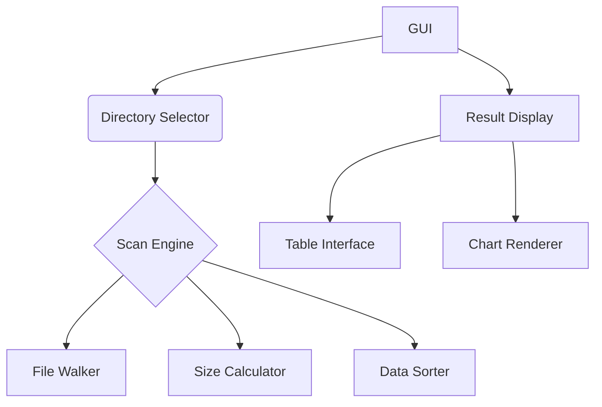

# Folder Size Analyzer 


## Key Features

### Visual Analytics
- 📊 Real-time directory size visualization
- 🗂️ Recursive subfolder scanning
- 🔍 Path hover details
- ⬇️ Auto size-sorting (descending)

### User Experience
- 🖱️ One-click directory selection
- 🚀 Parallel processing acceleration
- 📈 Live progress tracking

### Technical Edge
- ⚡ Rust-native performance
- 💻 Cross-platform binaries
- 🧩 Modular architecture
- 📦 Auto dependency management

## Usage Guide

### Prerequisites
1. Install Rust toolchain
```bash
curl --proto '=https' --tlsv1.2 -sSf https://sh.rustup.rs | sh
```

### Build & Run
```bash
cargo run --release
```

### Interface Operations
1. Click "Select Directory" button
2. Wait for scanning completion (progress bar)
3. Use column headers for sorting
4. Hover mouse for full path
5. Support multi-level directory expansion

## Advanced Configuration

### Font Management
- Place font files in `fonts/` directory
- Recommended font: `NotoSansCJKsc-Regular.otf`
- Automatic system font detection

### Performance Tuning
- Enable parallel processing: `RAYON_NUM_THREADS=4`
- Memory-optimized build: `cargo build --release`
- Large file handling cache settings

## Technical Architecture

### Core Components


### Dependencies
- GUI Framework: egui 0.21
- Parallel Processing: rayon 1.7
- Path Handling: walkdir 2.3 
- Size Formatting: bytesize 1.2

## Use Cases

### Typical Scenarios
- 💾 Quickly locate large files
- 🗑️ Pre-cleanup disk space analysis
- 📁 Project structure optimization
- 🔍 Storage utilization analysis

## License
MIT License - See [LICENSE](LICENSE) for details
